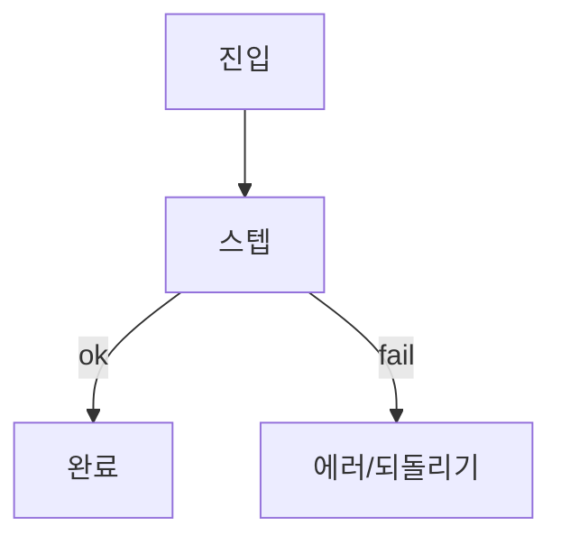

# 약콕 사용자 플로우 브리프

> GPT/이미지 생성용 입력 문서. 코드·PRD 스캔 결과.  
> 생성일: {{YYYY-MM-DD}} · stage: {{pre|prod}} · 근거 커밋/브랜치: {{optional}}

---

## 1. 제품 한 줄

{{한 문장. 예: 멀리 사는 가족이 원터치 복용 체크와 한 줄 컨디션으로 안부를 공유하는 앱.}}

**브랜드/톤 (이미지 스타일 힌트)**

- {{틸·잔소리 없는 가족 안부 · 감시 UI 금지 등 design.md 요약 2~3줄}}

---

## 2. 역할

| 역할 | 앱에서의 이름 | 인증 | 핵심 권한 |
|------|---------------|------|-----------|
| 보호자 | guardian | {{OAuth / 개발 로그인 등 — 코드 기준}} | {{가족 생성·초대·피드 등}} |
| 피보호자 | care_recipient | {{코드/QR만 등}} | {{본인 약·체크 등}} |

---

## 3. 화면 인벤토리 (구현 기준)

| 라우트 | 화면 | 탭/스택 | 역할 | 상태 |
|--------|------|---------|------|------|
| `/(tabs)/home` | 홈·기록 | tab | 전 역할 | implemented |
| … | … | … | … | implemented / partial / missing |

**미구현·기획만 (라우트 없음)**

| 의도 화면 | PRD/메모 | 상태 |
|-----------|----------|------|
| … | … | missing / prod-only |

---

## 4. 사용자 플로우

각 플로우: **목적 → 진입 → 스텝 → 분기/에러 → 종료**.  
상태: `implemented` | `partial` | `missing`.

### F1. {{플로우 이름}} — `{{status}}`

- **역할**: {{guardian | care_recipient | both}}
- **진입**: {{라우트 / 딥링크 / 알림}}
- **관련 코드**: `pages/…`, `features/…`, `widgets/…`

| # | 스텝 | 화면/UI | 사용자 행동 | 시스템 반응 | 상태 |
|---|------|---------|-------------|-------------|------|
| 1 | … | … | … | … | … |

**분기**

- {{성공 / 실패 / 한도 / 권한}} → {{다음}}

**Mermaid**



### F2. …

_(동일 형식 반복)_

---

## 5. 역할 × 플로우 매트릭스

| 플로우 | guardian | care_recipient | 비고 |
|--------|----------|----------------|------|
| F1 가입·가족 | ✅ | — | … |
| F2 코드 조인 | — | ✅ | … |
| … | … | … | … |

범례: ✅ 가능 · △ partial · ❌ 불가/없음 · — 해당 없음

---

## 6. 갭 · 부족한 부분

우선순위: P0(지금 막힘) → P1(PRD 대비) → P2(prod/polish).

| ID | 갭 | 근거 | 영향 플로우 | 우선 |
|----|-----|------|-------------|------|
| G1 | {{예: 2시뮬 Realtime 미검증}} | CHECKLIST 미체크 | F… | P0 |
| G2 | {{예: 탈퇴·약관}} | PRD prod | auth | P2 |

**의도적으로 빠진 것 (out of scope / stage)**

- {{mvp 스킵, hosted OAuth 등}}

---

## 7. 이미지 생성 지시 (GPT에 붙여넣기)

아래 블록을 **그대로** 이미지/다이어그램 생성 프롬프트로 사용한다.

```
제품: 약콕 — {{한 줄}}
목표: 모바일 앱 사용자 플로우 다이어그램 이미지
스타일: 깔끔한 UX 플로우차트, 한국어 라벨, 역할별 색 구분
  (보호자={{색}}, 피보호자={{색}}), 카드형 화면 노드, 화살표로 이동
금지: 감시·CCTV 느낌, 과도한 장식, 영문 UI 라벨 남발

포함할 플로우 (각각 별도 패널 또는 한 장에 swimlane):
1) {{F1 이름}}: {{스텝을 → 로 나열}}
2) {{F2 …}}

갭은 점선 노드 + "미구현" 라벨로 표시:
- {{G1 요약}}
- {{G2 요약}}

출력: {{한 장 전체도 / 플로우별 여러 장}} · 가로 16:9 또는 세로 모바일 친화
```

**패널 분할 제안** (이미지 여러 장일 때)

1. Onboarding & join  
2. Daily check (홈)  
3. Family feed & invite  
4. Medication CRUD  
5. Gaps overlay  

---

## 8. 변경 이력 (선택)

| 날짜 | 요약 |
|------|------|
| {{YYYY-MM-DD}} | 초안 |
