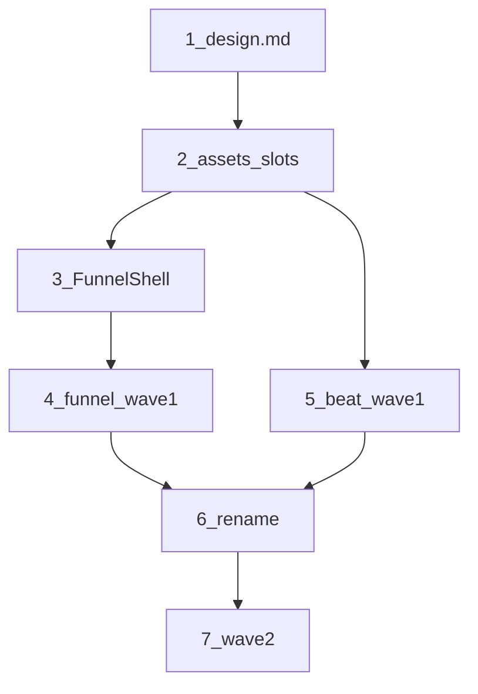

# 약콕 · 콕이 브랜드 플랜

시트(간호요정 콕이) 기준으로 앱·`design.md`를 맞추는 작업 묶음.  
정식 캐릭터 컷은 나중에 overwrite — 지금은 **슬롯·문서·placeholder** 먼저.

## 문서 지도

| 파일 | 내용 |
|------|------|
| [goals.md](goals.md) | 단계별 **목표·게이트** · 검토→실행 루프 |
| [gap.md](gap.md) | 갭 분석 · 에셋 인벤토리 · 팔레트 · placeholder 파일명 |
| [flows.md](flows.md) | 브랜드 beat **F1–F8** · 코드 훅 |
| [funnels.md](funnels.md) | 토스형 입력 퍼널 **ID P1–P6** |
| [design-edits.md](design-edits.md) | [docs/design.md](../design.md) 섹션별 수정안 |
| [impl.md](impl.md) | 투두 체크리스트 · 하지 말 것 |
| [decisions.md](decisions.md) | 기획 질문으로 **잠근 결정** |
| [deferred.md](deferred.md) | 플랜 닫힘 후 **보류·후속** 백로그 |

## ID 용어 (헷갈리지 말 것)

| 말 | 뜻 | 예 |
|----|-----|-----|
| **작업 단계** | README 아래 0–8번 | 단계 4 = 퍼널 1차 구현 |
| **F1–F8** | 콕이가 *언제* 나오나 (beat) | F2 = empty |
| **퍼널 P1–P6** | 입력 *어떻게* 쪼개나 (form ID) | 퍼널 P3 = 약 추가 |
| **1차 / 2차 / 보류** | 구현 우선순위 (beat·퍼널 공통) | 퍼널 1차 = P1·P2·P3 |

`P1`만 보고 판단하지 말 것 — **퍼널 P1(가족 만들기)** 과 **beat 1차(F1·F2·F6)** 는 다른 축.

## 한줄 결론

지금 앱 = **틸·아이콘·기능 안부 UI** + **한 화면에 필드 몰아넣기**.  
목표 = **세이지·콕이 beat** + **토스형 입력 퍼널**.

---

## 작업 순서 (이 순서대로)

에이전트/사람이 이 폴더를 보고 작업할 때 **아래 번호만** 따른다.  
각 단계: 읽을 문서 → 할 일 → **[goals.md](goals.md) 게이트 PASS** 후에만 다음 단계.

### 루프 (매 단계 공통)

1. [goals.md](goals.md) 해당 단계 목표·게이트 읽기  
2. **검토** — 게이트 항목별 PASS/FAIL  
3. FAIL만 **실행**  
4. 재검토 → 전부 PASS일 때만 다음 번호  
5. PASS 시 [impl.md](impl.md) 해당 행 `done`

상세 게이트 표·전체 성공 정의는 **goals.md가 SoT**. 아래는 요약.

### 0. 착수 전 (읽기만)

1. 이 README (특히 ID 용어)  
2. [gap.md](gap.md) — 왜 바꾸는지 · 파일명 · 색 방향  
3. 손댈 범위만: beat → [flows.md](flows.md) / 입력 → [funnels.md](funnels.md)

코드를 바로 건드리지 말 것. 문서 합의 → 구현.  
게이트: [goals.md](goals.md) §0

### 1. 디자인 소스 갱신

| | |
|--|--|
| 읽기 | [design-edits.md](design-edits.md) |
| 하기 | `docs/design.md`에 수정안 반영 (약콕, sage, Character, Brand flows, Funnel) |
| 끝 | [goals.md](goals.md) §1 — design.md SoT. theme hex는 방향만 |

### 2. 에셋 슬롯 (+ 테마는 나중)

| | |
|--|--|
| 읽기 | [gap.md](gap.md) Placeholder · [decisions.md](decisions.md) #8 |
| 하기 | `mobile/assets/koki/{slot}.png` · `KokiIllustration` · icon/splash placeholder. **색(sage)은 #8B — 틸 유지, 나중에** |
| 끝 | [goals.md](goals.md) §2 — variant require 맵 동작. 빈자리 없음 |

### 3. 입력 퍼널 뼈대

| | |
|--|--|
| 읽기 | [funnels.md](funnels.md) + [decisions.md](decisions.md) #5 |
| 하기 | 공유 `FunnelShell` — **full page만** |
| 끝 | [goals.md](goals.md) §3 — back / progress / 질문 타이틀 / 하단 CTA |

### 4. 퍼널 1차 — 필드 몰린 화면

| | |
|--|--|
| 읽기 | [funnels.md](funnels.md) **퍼널 P1·P2·P3** |
| 하기 | P1 가족 만들기 → P2 Join → P3 약 추가 (이 순. P3가 가장 두꺼움) |
| 끝 | [goals.md](goals.md) §4 — 한 질문 한 스텝. 콕이 입구·완료만 |

### 5. 브랜드 beat 1차 — 매일 경로

| | |
|--|--|
| 읽기 | [flows.md](flows.md) **F1·F2·F6** ([decisions.md](decisions.md) #1 — F3 흡수) |
| 하기 | Welcome `welcome` · Empty `thinking` · all-done `done` (리스트 위) |
| 끝 | [goals.md](goals.md) §5 — Lucide-only hero/empty 없음. 개별 체크 happy 없음 |

### 6. 이름 통일

| | |
|--|--|
| 읽기 | [decisions.md](decisions.md) #6 |
| 하기 | UI·카피 + AGENTS / TRACK / design / PRD `약먹었약` → `약콕` (`yakmuk` 유지). **app.json display name은 제외** |
| 끝 | [goals.md](goals.md) §6 — 위 범위에서 약먹었약 0건 |

### 7. 2차 확장

| | |
|--|--|
| 퍼널 | **P4** 약 수정 · **P5** 초대 생성 |
| beat | **F5** family · **F7** worried · **F4** streak (**N=3**, #3) |
| 끝 | [goals.md](goals.md) §7 · [impl.md](impl.md) funnel-wave2 / beat-wave2 |

### 8. 보류

게이트: [goals.md](goals.md) §8 — 보류를 1·2차에 끌어오지 않음.  
닫힘 후 목록·착수 순서: **[deferred.md](deferred.md)**

---

## 의존 관계

- 퍼널·beat 모두 **컷 슬롯(2)** + **카피 규칙(1)** 필요  
- FunnelShell(3) 없이 퍼널 P3 쪼개면 UI 중복  
- rename(6)은 UI 손댄 뒤 한 번에 (design.md 제목만 단계 1)  
- sage theme은 단계 2에 **안 넣음** (#8B)

목표·게이트·루프: [goals.md](goals.md) · 잠긴 결정: [decisions.md](decisions.md) · 체크리스트: [impl.md](impl.md)
