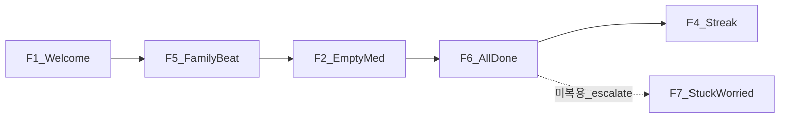

# 에셋 → 브랜드 플로우 (beat)

← [README](README.md) · 인벤토리 [gap.md](gap.md) · **입력 퍼널은 [funnels.md](funnels.md)**

시트 UI열·표정·소품이 암시하는 **브랜드 순간(beat)**.  
폼을 한 스텝씩 쪼개는 UX는 funnels.md (P1–P6).

F5 **beat**(가족 컷) ≠ 퍼널 **P1**(가족 입력).  
**성공 피드백 = F6만** ([decisions.md](decisions.md) #1). 개별 체크엔 콕이 없음.

---

## F1 — 첫 만남 (Welcome) — [decisions.md](decisions.md) #7C

- **시트:** 하트 완드 / 인사
- **현재:** 좌상단 콕이 1인칭 인사 + 중앙 `welcome` 컷 + 하단 CTA 스택
- **beat:** `welcome` 컷(히어로) + 타이틀 `안녕하세요. 저는 콕이에요` + 안부 서브 + CTA(`가족을 만들어요` / `초대코드를 받았어요`). 브랜드명 `약콕` 비표시
- **훅:** `mobile/src/pages/welcome/ui/WelcomePage.tsx`

## F2 — 기록 없음 (Empty)

- **시트:** Thinking
- **현재:** `Fallback` (콕이 + 설명 + round CTA) + 캘린더 아래
- **beat:** illustration=`thinking`, 카피 = `COPY.med.emptyRegistered*` (hint: 복용 기록해볼까요)
- **대상:** 약 0개
- **훅:** `HomePage` empty 분기 · `Fallback.tsx` · 액션 실패는 `ExceptionModal`
- **목업:** `docs/brand/mocks/home-empty.png`

## F3 — (폐기) 개별 복용 성공

[decisions.md](decisions.md) **#1** — 개별 체크 성공 beat **없음**.  
오늘 전부 완료 시에만 피드백 → **F6**.

## F4 — 연속 기록 (Streak) — [decisions.md](decisions.md) #3

- **시트:** 캘린더✓
- **규칙:** KST 기준 연속 all-done **N=3**. 스케줄 0일 = 연속 유지(스킵), 부분/미완 = 끊김
- **beat:** 연속≥3일일 때 캘린더 영역에 `streak` 컷 (상시·매일 강제 노출 금지)
- **차수:** 2차. 최소 연속일 계산 구현 (스킵 안 함)
- **훅:** `medication-calendar-panel/`

## F5 — 가족 empty / 초대 화면 (beat)

- **시트:** 집+하트
- **beat:** 가족 없음 empty · 초대 결과/공유 화면에 `family` 컷
- **입력 쪼개기:** 가족 *만들기* 폼 = 퍼널 P1, *초대 코드 만들기* = 퍼널 P5 ([funnels.md](funnels.md))
- **카피:** `COPY.family.emptyMembers` + `emptyMembersMessage` · CTA `inviteCta` (leader만)
- **훅:** `FamilyPage.tsx` · `FamilyGuardianDashboard` · 목업 `docs/brand/mocks/family-empty.png`

## F6 — 오늘 전부 완료 (Done) — [decisions.md](decisions.md) #1 + #2B

- **시트:** 클립보드 / (시트 Success와 동일 트리거)
- **트리거:** `taken == total` (오늘 스케줄 있는 약 전부 체크)
- **beat:** 오늘 체크 **인사 배너**에 `done` 컷 + `COPY.med.checkPromptDone` (시간대 리스트 유지)
- **아님:** 약 하나 체크할 때마다 콕이
- **훅:** `TodayMedicationPanel` (홈 스크롤 아래) · 목업 `docs/brand/mocks/home-today-done.png`
- **체크:** 개별 토글만 (일괄「다 먹었어요!」CTA 없음)

## F7 — stuck 안부 (Worried) — [decisions.md](decisions.md) #4A

- **시트:** Worried 표정만 (UI열 없음)
- **beat:** 보호자 stuck/미복용 안부에 `worried`. **경고·빨간 배너 대체** (병행 아님)
- **훅:** `FamilyGuardianDashboard.tsx`

## F8 — Action (알림·후속)

| 컷 | 시트 카피 | 훅 | 상태 |
|----|-----------|-----|------|
| `pill` | (풀페이지 히어로 — 시간+콕이, doseTitle은 OS notif만) | 복용 전 nudge / 알림 랜딩 `MedicationAlarmPage` | **연결** |
| `cheer` | 힘내요! | 오후 미복용 soft CTA | 파일만 |
| `lantern` | 함께 지켜요 | 보호자 온보딩 | 파일만 |
| `heart` | 참 잘했어요 | F6 강화 후보 | 파일만 |

---

## 우선순위 (beat)

| 차수 | Beat | 이유 |
|------|------|------|
| 1차 | F1, F2, F6 | 매일 경로. 성공=전부 완료만 |
| 2차 | F5, F7, F4 | 가족·stuck·streak(N=3) |
| 연결 | F8 `pill` | 알림 풀페이지 `MedicationAlarmPage` |
| 보류 | F8 나머지, F3(개별) | cheer/lantern/heart 예약. F3는 #1로 폐기 |

입력 퍼널 차수 → [funnels.md](funnels.md)  
작업 순서 SoT → [README.md](README.md)
