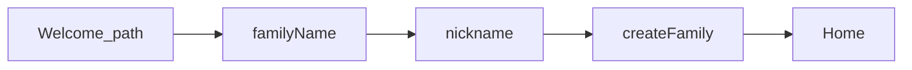
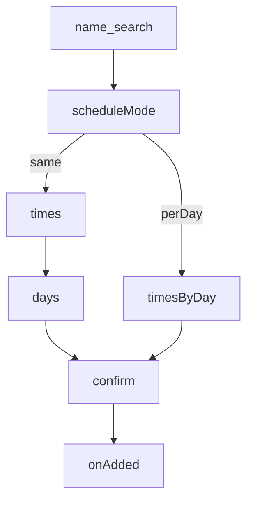

# 토스형 입력 퍼널

← [README](README.md) · 브랜드 beat는 [flows.md](flows.md)

사용자가 **폼(여러 필드)을 입력하려 할 때** 한 화면에 몰지 않고,  
토스처럼 **한 단계 = 질문 하나**로 퍼널을 탄다.

브랜드 플로우(F1–F8) = *언제 콕이가 나오나*  
이 문서 = *입력 UX를 어떻게 쪼개나*

---

## 원칙 (Toss-like)

| 규칙 | 내용 |
|------|------|
| 한 스텝 한 질문 | 타이틀이 질문. 필드 1개(또는 선택지 1묶음)만 |
| 진행은 느껴지게 | 얇은 step indicator 또는 `1/4` — 불안한 긴 바 금지 |
| 앞·뒤 | 뒤로 = 이전 스텝. 닫기 = 확인 후 discard(작성 중일 때) |
| CTA | 하단 고정 `다음` / 마지막만 `완료`·`저장` |
| 키보드 | 텍스트 스텝은 진입 시 포커스. 숫자/코드는 맞는 키패드 |
| 설명 최소화 | design.md §6.2 — 헬퍼 문단 금지. placeholder·타이틀로 |
| 콕이 | 퍼널 **첫 화면·완료 화면**에만 (중간 스텝 난립 금지). variant는 맥락별 |
| Low friction | 선택지 가능하면 타이핑 대신. 스킵 가능한 필드는 `나중에` |

### FunnelShell (공유 UI — 구현 시)

```
┌─────────────────────────┐
│ ←  back     ···  close  │
│ ░░ progress (subtle)    │
│                         │
│ 큰 질문 타이틀            │
│ (선택) 콕이 — 첫/완료만   │
│                         │
│ [ 입력 또는 선택지 ]      │
│                         │
│         [ 다음 / 완료 ]  │
└─────────────────────────┘
```

- **전부 full page** ([decisions.md](decisions.md) #5A). PageSheet 안 씀
- 상태: `stepIndex` + draft object. 제출은 마지막 스텝에서만

---

## 퍼널 목록

ID prefix **P** (Form funnel). 브랜드 F와 구분.

| ID | 퍼널 | 현재 | 목표 스텝 수 | 차수 |
|----|------|------|--------------|------|
| P1 | 가족 만들기 | Welcome에 familyName+nickname 한 화면 | 2–3 | 1차 |
| P2 | 초대 참여 (Join) | code+nickname 한 화면 | 2 | 1차 |
| P3 | 약 추가 | search → schedule(필드 몰림) | 4–5 | 1차 |
| P4 | 약 수정 | name+time+days 한 화면 | 3–4 | 2차 |
| P5 | 가족 초대 생성 | role+invitedAs 한 시트 | 2 | 2차 |
| P6 | 오늘 컨디션 | 홈 인라인 condition+message | 1–2 (시트 퍼널) | 보류 |
| — | 닉네임만 / 가족이름만 | 단일 필드 | 퍼널 불필요 | skip |

---

## P1 — 가족 만들기

**진입:** Welcome → 가족장 경로 · 로그인 후 `needsFamilySetup`  
**콕이:** 시작 `family` · 완료는 beat 생략 또는 `family` (1차에서 `happy` 미연결 — [decisions.md](decisions.md) #1)

| Step | 질문(타이틀) | UI | CTA |
|------|--------------|-----|-----|
| 1 | 가족 이름을 알려주세요 | Input (예: 우리집) | 다음 |
| 2 | 뭐라고 불러드릴까요? | Input 닉네임 | 만들기 |
| (3) | — | 짧은 완료 beat (콕이) → 홈 | 시작하기 |

훅: `WelcomePage.tsx` 가족 생성 블록을 FunnelShell로 분리.



---

## P2 — 초대 참여 (Join)

**진입:** Welcome → 초대코드 경로 / `JoinPage`  
**콕이:** 시작 `welcome` 또는 `family`

| Step | 질문 | UI | CTA |
|------|------|-----|-----|
| 1 | 초대코드를 입력해 주세요 | wide tracking Input | 다음 |
| 2 | 뭐라고 불러드릴까요? | Input (optional → `나중에` 허용) | 참여하기 |

훅: `JoinPage.tsx`

---

## P3 — 약 추가 (가장 두꺼움)

**진입:** FAB / empty CTA → `AddMedicationSheet`  
**현재:** `search` \| `schedule`(모드·시간·요일 한 덩어리)  
**콕이:** 시작 `thinking` (1차) · 완료 `done`  
`pill`은 F8 예약 — 퍼널 1차에서 쓰지 않음.

| Step | 질문 | UI | CTA |
|------|------|-----|-----|
| 1 | 어떤 약인가요? | 검색 리스트 / 직접 입력 | 다음 (선택·이름 확정 시) |
| 2 | 일정이 매일 같나요? | `same` \| `per-day` 선택 카드 | 다음 |
| 3a | 몇 시에 먹나요? | TimeSlotList (same) | 다음 |
| 3b | 요일마다 시간을 알려주세요 | 요일×시간 (per-day) | 다음 |
| 4 | 어느 요일에 먹나요? | DaysMode / WeekdayPicker — **3a 경로만**. per-day면 스킵·병합 | 다음 |
| 5 | 이 내용으로 등록할까요? | 요약 카드 (이름·시간·요일) | 저장 |

분기: step2=`same` → 3a → 4 → 5 / `per-day` → 3b → 5  
기존 validation (`scheduleValidationMessage`)은 해당 스텝 CTA disable에 연결.



훅: `AddMedicationSheet.tsx` — step enum 확장, schedule 화면 분해.

---

## P4 — 약 수정

**진입:** MedRow long-press / 수정  
P3와 동일 축, 시작 값이 draft에 prefill.  
스텝: 이름 → 시간 → 요일 → 확인(또는 이름 스킵하고 스케줄만).

훅: `EditMedicationSheet.tsx`

---

## P5 — 가족 초대 생성

**진입:** Family / Settings → 초대  
**콕이:** `family`

| Step | 질문 | UI | CTA |
|------|------|-----|-----|
| 1 | 누구를 초대할까요? | 역할 선택 (보호자/피보호자 등) | 다음 |
| 2 | 초대할 분의 호칭은? | Input `invitedAs` | 초대코드 만들기 |
| (3) | 코드 공유 | 코드 + 공유 CTA — 입력 퍼널 종료 beat | 완료 |

훅: `FamilyInvitePanel.tsx`

---

## P6 — 오늘 컨디션 (선택적 승격)

**현재:** 홈 인라인 chips + message + 제출  
**방향:** “컨디션 전하기” 탭 시 짧은 시트 퍼널

| Step | 질문 | UI | CTA |
|------|------|-----|-----|
| 1 | 오늘 컨디션은 어때요? | GOOD/NORMAL/BAD 큰 선택 | 다음 (BAD면 메시지 스텝) |
| 2 | 가족에게 한마디 (선택) | Input · `건너뛰기` | 전하기 |

GOOD/NORMAL은 step2 스킵 가능.  
홈 인라인 유지 vs 퍼널 승격이 Low friction과 충돌하면 **보류 유지**.

---

## 브랜드 beat와 겹치는 지점

| 퍼널 | 시작 컷 | 완료 컷 | flows.md |
|------|---------|---------|----------|
| P1 가족 만들기 | family | family 또는 생략 | F1 → F5 |
| P2 Join | welcome/family | — | F1 |
| P3 약 추가 | thinking | done | F2 → (등록 후) F6 |
| P5 초대 | family | family | F5 |
| P6 컨디션 | — | happy 또는 done | F6 근처 (보류) |

중간 스텝에는 콕이 안 넣음 (질문+입력만).

---

## design.md에 넣을 한 절 (요약)

[design-edits.md](design-edits.md)에 § Funnel 추가:

- 다필드 입력 = **한 질문 한 스텝** 퍼널
- FunnelShell: 큰 질문 타이틀 · 하단 CTA · 약한 progress
- 캐릭터는 퍼널 입구·완료만
- 단일 필드(닉네임만)는 퍼널 강제 금지

---

## 구현 우선순위 (퍼널)

| 차수 | 퍼널 ID | 이유 |
|------|---------|------|
| 1차 | P1, P2, P3 | 온보딩·핵심 등록. 필드 몰림 심함 |
| 2차 | P4, P5 | 대칭·가족 확장 |
| 보류 | P6 | 홈 인라인 유지 가능 |
| skip | 닉네임/가족명 단일 | 이득 없음 |

`FunnelShell`을 퍼널 P1에 먼저 깔고, P3가 최대 소비자.  
작업 순서 → [README.md](README.md)
