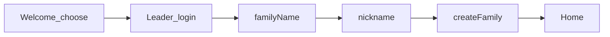
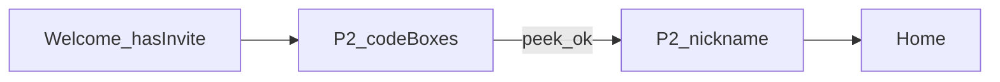
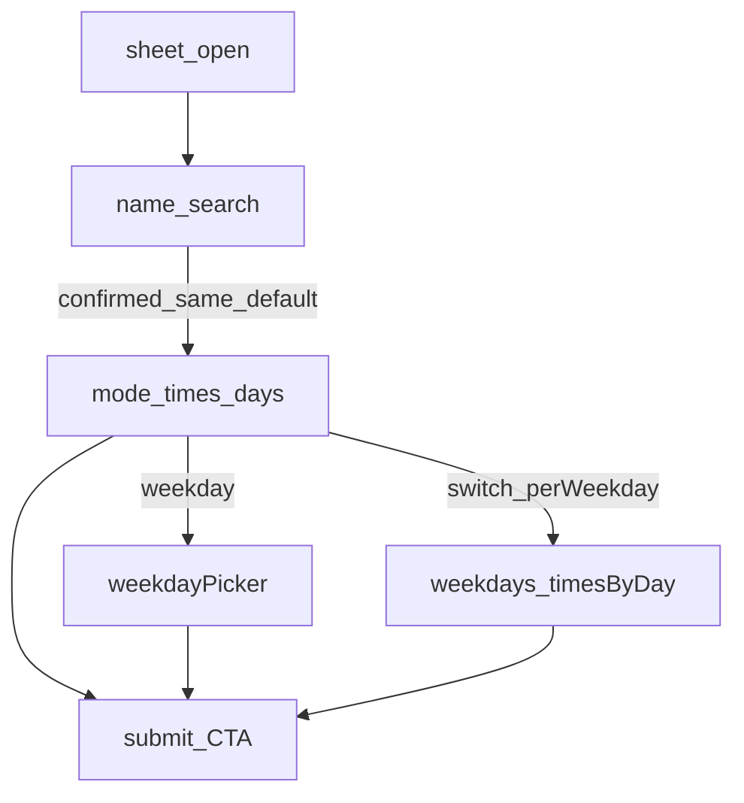

# 토스형 입력 퍼널

← [README](README.md) · 브랜드 beat는 [flows.md](flows.md)

사용자가 **폼(여러 필드)을 입력하려 할 때** 한 화면에 몰지 않고,  
토스처럼 **한 단계 = 질문 하나**로 퍼널을 탄다.

브랜드 플로우(F1–F8) = *언제 콕이가 나오나*  
이 문서 = *입력 UX를 어떻게 쪼개나*

---

## 원칙 (Toss-like)

| 규칙 | 내용 |
|------|------|
| 한 스텝 한 질문 | 타이틀이 질문. 필드 1개(또는 선택지 1묶음)만 |
| 진행은 느껴지게 | 얇은 step indicator 또는 `1/4` — 불안한 긴 바 금지 |
| 앞·뒤 | 뒤로 = 이전 스텝. 닫기 = 확인 후 discard(작성 중일 때) |
| CTA | 하단 고정 `다음` / 마지막만 `완료`·`저장` |
| 키보드 | 텍스트 스텝은 진입 시 포커스. 숫자/코드는 맞는 키패드 |
| 설명 최소화 | design/surface §8.2 — 헬퍼 문단 금지. placeholder·타이틀로 |
| 콕이 | 퍼널 **첫 화면·완료 화면**에만 (중간 스텝 난립 금지). variant는 맥락별 |
| Low friction | 선택지 가능하면 타이핑 대신. 스킵 가능한 필드는 `나중에` |

### FunnelShell (공유 UI — 구현 시)

```
┌─────────────────────────┐
│ ←  back     ···  close  │
│ ░░ progress (subtle)    │
│                         │
│ 큰 질문 타이틀            │
│ (선택) 콕이 — 첫/완료만   │
│                         │
│ [ 입력 또는 선택지 ]      │
│                         │
│         [ 다음 / 완료 ]  │
└─────────────────────────┘
```

- FunnelShell = **온보딩·초대 full page** ([decisions.md](decisions.md) #5B). PageSheet 안 씀
- **약 추가·수정(P3·P4) = BottomSheet progressive** — 한 스텝 한 질문 FunnelShell 강제 아님
- 상태: Funnel은 `stepIndex` + draft. Sheet는 reveal + draft. 제출은 CTA에서

---

## 퍼널 목록

ID prefix **P** (Form funnel). 브랜드 F와 구분.

| ID | 퍼널 | 현재 | 목표 스텝 수 | 차수 |
|----|------|------|--------------|------|
| P1 | 가족 만들기 | 로그인 + FunnelShell 2스텝 (이름·호칭) | 2 (+로그인) | 1차 |
| P2 | 초대 참여 (Join) | 6칸 코드 + 프리뷰 카드 → 호칭(선택) | 2 | 1차 |
| P3 | 약 추가 | BottomSheet progressive | — | 1차 |
| P4 | 약 수정 | BottomSheet full unlock + prefill | — | 2차 |
| P5 | 가족 초대 생성 | role+invitedAs 한 시트 | 2 | 2차 |
| P6 | 오늘 컨디션 | 홈 인라인 condition+message | 1–2 (시트 퍼널) | 보류 |
| — | 닉네임만 / 가족이름만 | 단일 필드 | 퍼널 불필요 | skip |

---

## P1 — 가족 만들기

**진입:** Welcome choose → 가족장 로그인 → OAuth 후 `needsFamilySetup`  
**콕이:** step1 `family` · step2 `happy` (P1 슬롯만 — F6 성공 beat와 별개)  
**셸:** `hideProgress` · X 없음 · back만 (step0 back = signOut → 로그인)

| Step | 질문(타이틀) | UI | CTA |
|------|--------------|-----|-----|
| 로그인 | 안부를 나누기 위해\n로그인이 필요해요 | Google/Apple (+dev) | — |
| 1 | 우리 가족을\n어떻게 부를까요? | Input + `n/20` · placeholder 가족 이름 예 | 다음 |
| 2 | 콕이는\n뭐라고 불러드릴까요? | Input + `n/10` · placeholder 호칭 예 | 만들기 |

훅: `WelcomePage.tsx` · `FunnelShell` (`stagger` = 콕이 → 타이틀 → 필드/CTA)



---

## P2 — 초대 참여 (Join)

**진입:** Welcome → 「초대코드를 받았어요」 / `JoinPage` · deep link `?code=`  
**콕이:** step0 없음 · step1 `happy`  
**셸:** `hideProgress` · X 없음 · back만  
**인증:** OAuth 없음 — `joinWithInviteCode` anon + `claim_join_code`

| Step | 질문 | UI | CTA |
|------|------|-----|-----|
| 1 | 초대코드를 입력해 주세요 | 6칸 `InviteCodeInput` + peek `FamilyPeekCard` (`{리더}님의 가족` · 멤버 `·` 목록) | 다음 |
| 2 | 콕이는\n뭐라고 불러드릴까요? | Input `0/10` · placeholder 호칭(선택) · **나중에 할게요** | 참여하기 |

훅: `JoinPage.tsx` · peek=`peek_join_code` (`member_nicknames`)



---

## P3 — 약 추가

**진입:** FAB / empty CTA → `/add-medication` → `AddMedicationSheet` (BottomSheet)  
**표면:** progressive disclosure — 처음부터 전체 폼 ❌  
**콕이:** 완료 `done`만 (중간 블록 금지)

| 단계 | 트리거 | UI |
|------|--------|-----|
| 1 | 시트 오픈 | 이름 검색 / 직접 입력+확인 CTA |
| 2 | 이름 확정 (기본 `same`) | ScheduleModeToggle + TimeSlotList + DaysModeToggle **즉시** |
| 2a | `daysMode=weekday` | WeekdayPicker |
| 2b | `perWeekday` 전환 | 하위 collapse → WeekdayPicker → 요일별 TimeSlotList |
| 3 | CTA | sticky `등록하기` (invalid면 disabled). confirm 스텝 없음 |

- 앞단계 변경 → 뒤 섹션 collapse + draft 리셋
- soft fill: `surfaceSoft` (시트 안 Input/토글)
- 훅: `AddMedicationSheet.tsx` · `MedicationScheduleFields` · `resolveFormVisibility`



---

## P4 — 약 수정

**진입:** MedRow 수정 → `EditMedicationSheet`  
P3와 동일 BottomSheet 축. **진입 시 전체 섹션 펼침 + draft prefill.**  
수정 중 모드 변경 시 collapse는 P3와 동일.  
CTA: sticky `저장`.

훅: `EditMedicationSheet.tsx`

---

## P5 — 가족 부르기 (초대 생성)

**진입:** `/family-manage` 자리표 빈 칸 `+` → `/invite-create`  
**얼굴:** 빈 원 플레이스홀더 (콕이 컷 없음)

| Step | 질문 | UI | CTA |
|------|------|-----|-----|
| 1 | 누구를 부를까요? | 보호자/피보호자 + 호칭 칩·직접 입력 | 초대장 만들기 |
| 2 | 초대장을 준비했어요 | 여섯 글자 + QR + 공유하기 | 완료 |

훅: `InviteCreateFunnel.tsx` · 자리표 `FamilySeatGrid.tsx` (max 6)

---

## P6 — 오늘 컨디션 (선택적 승격)

**현재:** 홈 인라인 chips + message + 제출  
**방향:** “컨디션 전하기” 탭 시 짧은 시트 퍼널

| Step | 질문 | UI | CTA |
|------|------|-----|-----|
| 1 | 오늘 컨디션은 어때요? | GOOD/NORMAL/BAD 큰 선택 | 다음 (BAD면 메시지 스텝) |
| 2 | 가족에게 한마디 (선택) | Input · `건너뛰기` | 전하기 |

GOOD/NORMAL은 step2 스킵 가능.  
홈 인라인 유지 vs 퍼널 승격이 Low friction과 충돌하면 **보류 유지**.

---

## 브랜드 beat와 겹치는 지점

| 퍼널 | 시작 컷 | 완료 컷 | flows.md |
|------|---------|---------|----------|
| P1 가족 만들기 | family → happy | — (홈 직행) | F1 → F5 |
| P2 Join | happy (step2) | — | F1 |
| P3 약 추가 | thinking | done | F2 → (등록 후) F6 |
| P5 초대 | family | family | F5 |
| P6 컨디션 | — | happy 또는 done | F6 근처 (보류) |

중간 스텝에는 콕이 안 넣음 (질문+입력만).

---

## design.md에 넣을 한 절 (요약)

[design-edits.md](design-edits.md)에 § Funnel 추가:

- 다필드 입력 = **한 질문 한 스텝** 퍼널
- FunnelShell: 큰 질문 타이틀 · 하단 CTA · 약한 progress
- 캐릭터는 퍼널 입구·완료만
- 단일 필드(닉네임만)는 퍼널 강제 금지

---

## 구현 우선순위 (퍼널)

| 차수 | 퍼널 ID | 이유 |
|------|---------|------|
| 1차 | P1, P2, P3 | 온보딩·핵심 등록. 필드 몰림 심함 |
| 2차 | P4, P5 | 대칭·가족 확장 |
| 보류 | P6 | 홈 인라인 유지 가능 |
| skip | 닉네임/가족명 단일 | 이득 없음 |

`FunnelShell`을 퍼널 P1에 먼저 깔고, P3가 최대 소비자.  
작업 순서 → [README.md](README.md)
