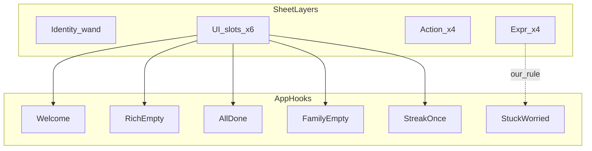

# 갭 분석 · 에셋 인벤토리

← [README](README.md)

## 이미 맞는 부분 (유지)

| design.md | 캐릭터 시트 | 판단 |
|-----------|-------------|------|
| 잔소리 없는 가족 안부 | “가족을 지키는 간호요정” | 제품 감정 일치 |
| 병원 블루/대시보드 금지 | clay chibi, 따뜻한 케어 | 일치 |
| Low friction · 한 화면 한 일 | UI 예시도 empty/success 한 메시지 | 일치 |
| 해요체·짧은 카피 | “기뻐요!” “기록할게요!” | 톤 호환 (시트 쪽이 더 감정형) |
| brand축 success (이질 블루 금지) | sage로 완료/칭찬 | 축 같음, hue만 다름 |

---

## 갭 1 — 브랜드 정체성

| 항목 | 현재 | 시트 | 갭 |
|------|------|------|-----|
| 제품명 | **약먹었약** | **약콕** | 코드/문서에 `약콕` 0건 |
| 마스코트 | 없음 | **콕이** (간호요정) | design.md에 Character 섹션 없음 |
| 스토어 크롬 | Expo 기본 아이콘/스플래시 | 콕이 기반 아이콘 | 브랜드 크롬 전무 |

공식명 `약콕` + 마스코트 `콕이`. 기술 식별자 `yakmuk` 유지.

---

## 갭 2 — 색

현재: `brand` `#0F6B5C` 쿨 틸 · `canvas` `#F4F7F6` 쿨 민트.  
시트: mid sage · pale mint · off-white.

**할 일 (문서):** Why teal → Why sage 서사.  
**구현 ([decisions.md](decisions.md) #8B):** hex/`theme.ts`는 **지금 안 바꿈** (틸 유지). 리샘플은 후속.

---

## 갭 3 — 캐릭터 시스템

시트 D열(UI 예시 6) = 앱 화이트리스트. B/C = 컷 라이브러리.



| 시트 D 슬롯 | 현재 훅 | 부족 |
|-------------|---------|------|
| Onboarding | Welcome = Pill + 약먹었약 | 콕이 없음 |
| Empty | RichEmptyState = Lucide | illustration 없음 |
| Success | brandSoft / Alert | 감정 컷 없음 |
| Streak | MedCalendar 기능만 | 칭찬 컷 없음 |
| Family | ChoiceCard + 아이콘 | 브랜드 순간 없음 |
| Done | `allDoneToday` 텍스트 | 클립보드 콕이 없음 |

플로우 상세 → [flows.md](flows.md)  
입력 퍼널 갭 → [funnels.md](funnels.md)

---

## 갭 4 — design.md 원칙과의 긴장

| design.md | 시트 리스크 | 해소 |
|-----------|-------------|------|
| §6.2 카피 최소화 | Empty/Streak/Family 설명 문장 | 포즈만 채택, 카피는 기존 COPY 한 줄 |
| §7 파티클 금지 | Success 스파클 | bake-in 정적 OK, 애니메이션 금지 |
| §5 시스템 폰트 | 히어로 약함 | 폰트 유지, 존재감은 콕이 |
| 병원 앱 금지 | 캡 십자가·간호복 | clay+sage로 완화, 임상 UI 금지 유지 |
| Low friction | 컷 14장 남발 | D열 6 + stuck만 연결. cheer/pill/lantern/heart는 예약 |

수정 문구 → [design-edits.md](design-edits.md)

---

## 갭 5 — 입력 UX (토스형 퍼널)

| 현재 | 목표 |
|------|------|
| Welcome 가족생성 familyName+nickname 한 화면 | 퍼널 P1 한 질문 한 스텝 |
| Join code+nickname 한 화면 | 퍼널 P2 |
| 약 추가 schedule 필드 몰림 | BottomSheet P3 progressive (이름 확정 후 same 즉시) |
| 약 수정·초대 생성 한 시트 | P4 = EditMedicationSheet / P5 = 초대 퍼널 |

원칙·스텝표 → [funnels.md](funnels.md)

---

## 에셋 시트 인벤토리 (3층)

### A. Identity (히어로 1)

- 전신 + 하트 지팡이 + 간호캡(세이지 십자가) + 반투명 윙
- **앱 매핑:** Welcome 히어로 · app icon/splash 소스

### B. Expressions ×4

| 시트 라벨 | 포즈 | 앱에 쓸 곳 |
|-----------|------|------------|
| 기뻐요! Happy | 눈감고 미소 + 하트 | 에셋 예약 (1차 미연결 — 성공은 F6 `done`) |
| 생각중이에요 Thinking | 턱괴고 위를 봄 | Empty state |
| 힘내요! Cheer | 주먹 불끈 | soft nudge (UI열 없음 — 확장) |
| 걱정돼요 Worried | 손 모으고 걱정 | stuck / 보호자 (**우리 해석**) |

### C. Actions ×4

| 시트 라벨 | 소품 | UI열? | 앱 매핑 |
|-----------|------|-------|---------|
| 약 먹을 시간이에요! | 알약 | ❌ | 복용 전 CTA — 예약 |
| 기록할게요! | 클립보드✓ | ✅ | `allDoneToday` |
| 참 잘했어요! | 하트 포옹 | △ | Happy 우선, Heart는 강화용 |
| 함께 지켜요! | 랜턴 | ❌ | 보호자 케어 — 예약 |

### D. App usage ×6 (슬롯 화이트리스트)

| # | 장면 | 컷 | 시트 카피 | 앱 훅 |
|---|------|-----|-----------|--------|
| 1 | Onboarding | 손흔들기 | “안녕하세요!…” | Welcome |
| 2 | Empty | Thinking | 긴 문장 — §6.2 위반 | RichEmptyState |
| 3 | Success | Happy + 스파클 | (시트) | → 앱에선 F6 `done`으로 흡수 (#1) |
| 4 | Streak | 캘린더 | 설명형 — 축약 | 연속 시에만 |
| 5 | Family | 집+하트 | 설명형 | 가족 empty/초대 |
| 6 | Done | 클립보드 | “다 확인했어요!” | `allDoneToday` |

### 시트에 없는 매핑 (우리 규칙)

- **Worried → stuck** — UI열 없음. 채택, design.md에 명시
- **Cheer / Pill / Lantern** — 파일 예약, **beat·퍼널 1차에서 미연결** (F8)
- **Heart vs Happy** — success는 Happy 우선

### 스타일·제작 주의 (정식 컷)

- 투명 PNG, 드롭섀도 최소화
- 스파클 bake-in OK, 런타임 파티클 금지
- 시트 마케팅 카피 → 앱은 기존 짧은 `COPY`만

### 팔레트 → 토큰 방향

시트 5단: deep forest → mid sage → light sage → pale mint/off-white → light grey

| 시트 느낌 | 현재 토큰 | 조정 |
|-----------|-----------|------|
| mid sage | `brand` `#0F6B5C` | 웜 sage 1스텝 |
| pale mint | `brandSoft` | 유지~약간 웜 |
| off-white | `canvas` | 뉴트럴 오프화이트 |
| deep forest | 없음 | pressed용만, 토큰 남발 금지 |
| 헤어·윙 | 없음 | illustration-only |

---

## Placeholder 전략

```
mobile/assets/koki/
  welcome.png      # D1
  thinking.png     # B Thinking = D2
  happy.png        # B Happy = D3
  done.png         # C clipboard = D6
  family.png       # D5
  streak.png       # D4
  worried.png      # stuck (우리 규칙)
  # 예약 (미연결)
  cheer.png
  pill.png
  lantern.png
  heart.png
```

- `KokiIllustration`: `variant` → static `require` 맵 (Metro 동적 경로 금지)
- icon/splash: placeholder 1장으로 Expo 블루 제거
- 정식 컷: **동일 파일명 overwrite만**
