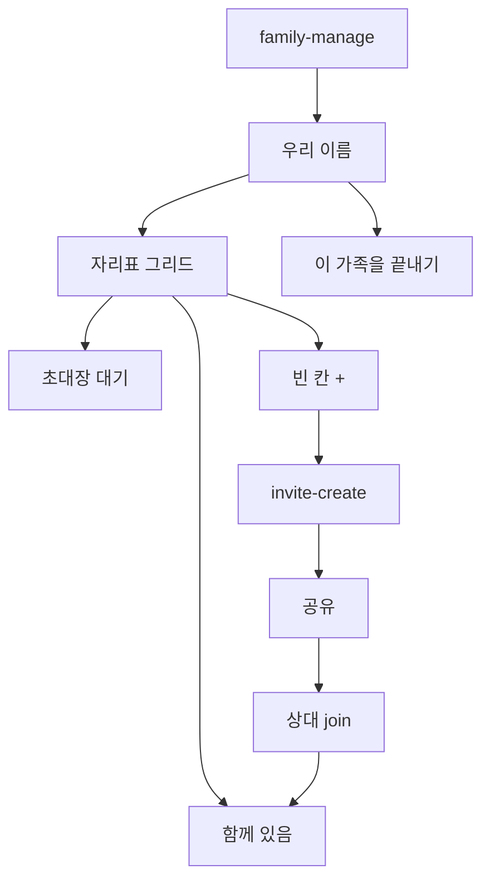

# 약콕 사용자 플로우 브리프 — 가족 관리 자리표(그리드)

> GPT/이미지 생성용 입력 문서. 코드·PRD 스캔 + 확정 UX.  
> 생성일: 2026-08-10 · stage: pre · 근거: `main` (자리표·한도6·부르기 퍼널)  
> 범위: `/family-manage` · `/invite-create` · Welcome/Join 초대장 카피  
> 상위: [family-tab-flow-brief.md](./family-tab-flow-brief.md) (F5·F6)

---

## 1. 제품 한 줄

멀리 사는 가족이 **원터치 복용 체크**와 **한 줄 안부**로 서로를 챙기는 앱(약콕).  
가족 관리는 **관리자 콘솔이 아니라 “우리 집 사람들 자리표”**.

**브랜드/톤 (이미지 스타일 힌트)**

- 잔소리 없는 가족 건강 안부. 틸/세이지. 병원·감시·CCTV·SaaS 어드민 UI 금지.
- 짧은 한국어. “코드발급 / 재발급 / 연결 / 대기” 시스템 명사 최소화.
- empty 칸은 **「+」만**. 얼굴은 **빈 원형 플레이스홀더** (이모지 없음).

---

## 2. 역할

| 역할 | 앱에서의 이름 | 인증 | 이 화면에서의 핵심 |
|------|---------------|------|-------------------|
| 가족장 | `family_leader` | OAuth / 개발 로그인 → 가족 생성 | 자리표 · `+`로 부르기 · 내보내기 · 초대장 새로 주기 · 가족 끝내기 |
| 보호자 | `guardian` | 여섯 글자/QR 조인 | 자리표 열람(메뉴/`+` 없음) |
| 피보호자 | `care_recipient` | 여섯 글자/QR만 | 동일 · 열람만 |

---

## 3. 화면 인벤토리 (구현 기준 · 이 스코프)

| 라우트 | 화면 | 탭/스택 | 역할 | 상태 |
|--------|------|---------|------|------|
| `/family-manage` | 우리 가족 — 이름 + 자리표 + 끝내기 | stack | leader ops · 비leader 열람 | **implemented** |
| `/invite-create` | 부르기 (역할+호칭 → 초대장 공유) | stack | leader | **implemented** |
| `/welcome` | 「초대장을 받았어요」 | stack | 미가족 | **implemented** (카피) |
| `/join` · `/join-link` | 초대장 여섯 글자 | stack | 조인 | **implemented** (카피) |
| `/(tabs)/family` | empty CTA「가족 부르기」 | tab | leader CTA | **implemented** |

---

## 4. 사용자 플로우

### F-MG1. 자리표 그리드 — `implemented`

- **역할**: leader ops · 비leader 열람
- **진입**: 가족 탭「관리」→ `/family-manage`
- **관련 코드**: `pages/family-manage` · `FamilySeatGrid` · `buildFamilySeats`

| # | 스텝 | 화면/UI | 사용자 행동 | 시스템 반응 | 상태 |
|---|------|---------|-------------|-------------|------|
| 1 | 이름 | 상단 Input/저장 (리더) | 저장 | updateFamilyName | implemented |
| 2 | 자리표 | 2열 · max 6 · 함께/대기/빈(+) | — | members∪pending∪empty | implemented |
| 3 | 빈 칸 | `+`만 | 탭 | `/invite-create` · 한도 Alert | implemented |
| 4 | 사람 칸 | 빈 원 · 호칭 · 역할 | ⋯ 메뉴 | 내보내기 · **초대장 새로 주기**(연결됨 → 강제 로그아웃+재입장). Android 가족 탭 가로 자리표도 동일 | implemented |
| 5 | 대기 칸 | dashed 원 · 아직 안 오셨어요 | ⋯ 메뉴 | 새로 주기 · 삭제(다시 오는 길은 삭제 불가) | implemented |
| 6 | 끝내기 | 맨 아래 round destructive | Confirm | welcome | implemented |

**Mermaid**



---

### F-MG2. 부르기 퍼널 — `implemented`

- **역할**: leader
- **진입**: 빈 칸 `+` → `/invite-create`
- **관련 코드**: `InviteCreateFunnel` · `canCreateInvite`

| # | 스텝 | UI | CTA | 상태 |
|---|------|-----|-----|------|
| 0 | 누구를 부를까요? | 빈 원 · 보호자/피보호자 · 호칭 칩+직접 입력 | 초대장 만들기 | implemented |
| 1 | 초대장을 준비했어요 | 여섯 글자 · QR · 공유하기 | 완료 | implemented |

역할+호칭 없으면 CTA disabled.

---

### F-MG3. Welcome · Join 카피 — `implemented`

| 위치 | 문구 | 상태 |
|------|------|------|
| Welcome | 초대장을 받았어요 | implemented |
| Join | 초대장 여섯 글자를 적어 주세요 | implemented |
| reissue / forceSignOut | 초대장 새로 주기 톤 | implemented |

동작·딥링크 스키마 변경 없음.

---

## 5. 역할 × 플로우 매트릭스

| 플로우 | family_leader | guardian | care_recipient | 비고 |
|--------|---------------|----------|----------------|------|
| F-MG1 자리표 | ✅ | △ 열람 | △ 열람 | |
| F-MG2 부르기 | ✅ | ❌ | ❌ | |
| F-MG3 Join 카피 | — | ✅ 조인 | ✅ 조인 | |

---

## 6. 갭 · 부족한 부분

| ID | 갭 | 근거 | 우선 |
|----|-----|------|------|
| G1 | 구 `FamilyInvitePanel` 미제거(미사용 export) | dead code | P2 |
| G2 | 「함께한 날」메타 | 범위 밖 | out |
| G3 | 한글 초대 코드 | 범위 밖 · 서버 영문숫자 유지 | out |

**확정 결정**

| 항목 | 선택 |
|------|------|
| 격자 | 사람 + 대기 + 빈 칸 · 상한 **6** · 리더는 그리드 밖 |
| 빈 칸 | `+` → `/invite-create` |
| 퍼널 | 역할+호칭 **한 스텝** → 공유 |
| 얼굴 | 빈 원 플레이스홀더 |

---

## 7. 이미지 생성 지시 (GPT에 붙여넣기)

```
제품: 약콕 — 가족 안부 앱
범위: /family-manage 자리표(6칸) + 부르기 퍼널(역할+호칭→공유)
스타일: 화이트 톤 · brand(#2F6F68) 포인트 · rounded-2xl · 빈 원 얼굴(이모지 없음)
라벨: 우리 가족 / 아직 안 오셨어요 / + / 이 가족을 끝내기 / 누구를 부를까요? / 초대장을 준비했어요 / 공유하기
금지: 코드발급·재발급·연결됨·대기·초대 섹션 어드민 라벨
출력: 가로 16:9 · manage + funnel 2패널
```

---

## 8. 변경 이력

| 날짜 | 요약 |
|------|------|
| 2026-08-10 | 초안(To-Be missing) |
| 2026-08-10 | 구현: 한도6 · FamilySeatGrid · 역할+호칭 퍼널 · 초대장 카피 |
| 2026-09-08 | Android 가족 탭 자리표 멤버 칸에서도 초대장 새로 주기 (연결됨 포함) |
