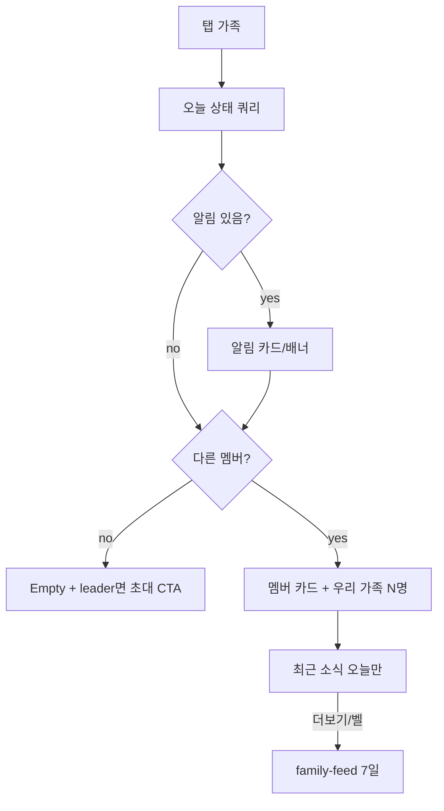
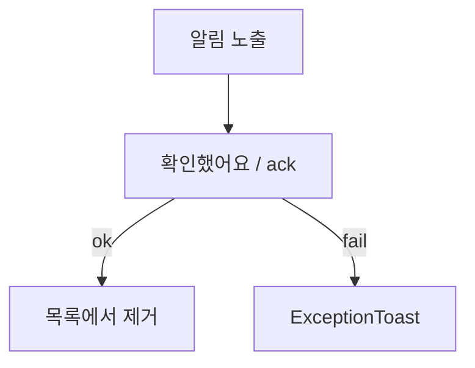
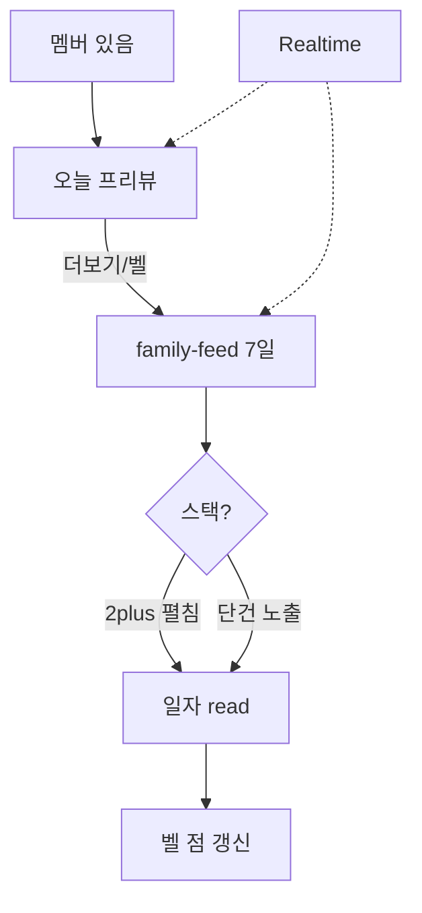
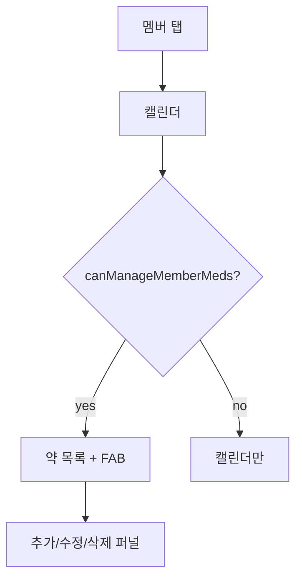
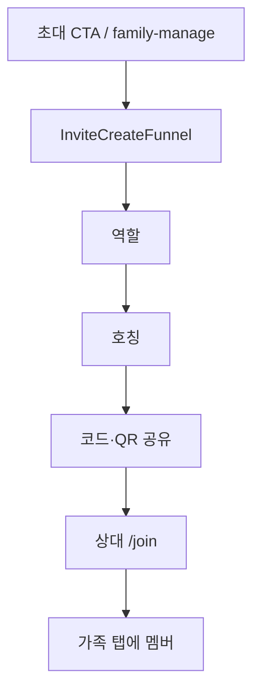
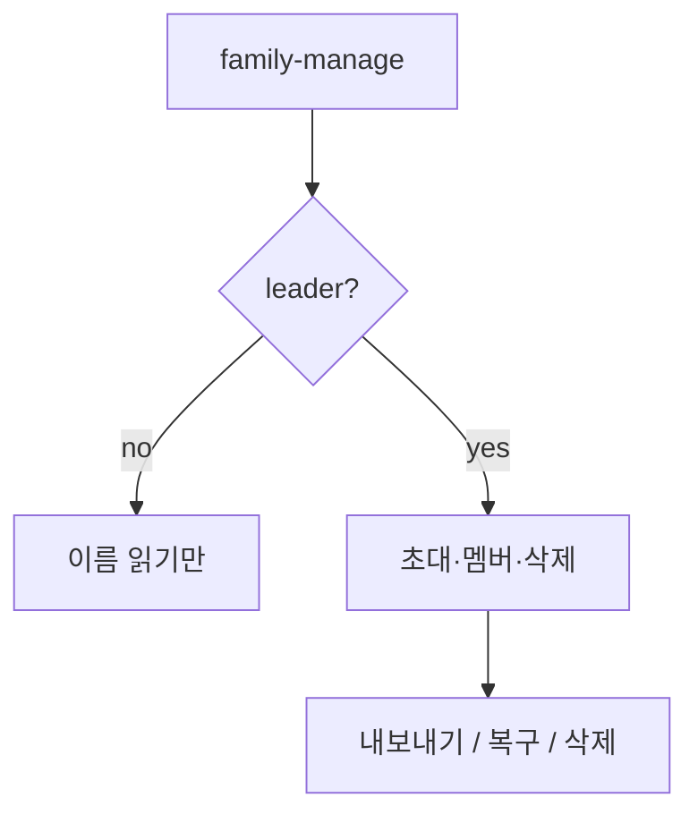

# 약콕 사용자 플로우 브리프 — 가족 탭

> GPT/이미지 생성용 입력 문서. 코드·PRD 스캔 결과.  
> 생성일: 2026-07-31 · stage: pre · 근거: `main` @ `b1a13e7`  
> 범위: `/(tabs)/family` 및 여기서 나가는 가족 도메인 화면 (멤버·family-manage·초대)

---

## 1. 제품 한 줄

멀리 사는 가족이 **오늘 복약·컨디션**과 **한 줄 안부 피드**로 서로를 챙기는 앱(약콕).

**브랜드/톤 (이미지 스타일 힌트)**

- 잔소리 없는 가족 건강 안부. 틸/세이지 케어. 병원·감시·CCTV UI 금지.
- 짧은 한국어 라벨. 대시보드 통계 남발 금지. empty는 콕이 일러스트 + 짧은 문장.

---

## 2. 역할

| 역할 | 앱에서의 이름 | 인증 | 가족 탭에서의 핵심 |
|------|---------------|------|-------------------|
| 가족장 | `family_leader` | 보호자 OAuth / 개발 로그인 → 가족 생성 | 오늘 상태·피드·알림 ack · 섹션 제목=가족명 + **관리** → `/family-manage` · empty 시 **가족 초대** CTA · 피보호자 약 대리 관리 |
| 보호자 | `guardian` | 초대 코드/QR로 조인 | 오늘 상태·피드·알림 ack · 피보호자 약 대리 관리 (`canManageMemberMeds`) · 초대 UI 없음 |
| 피보호자 | `care_recipient` | 6자리 코드/QR만 (닉네임 사전 설정) | 오늘 상태·피드 열람 · 멤버 탭 시 캘린더만(약 CRUD 불가) |

PRD 요약의 “보호자/피보호자” 이분법 → 코드는 **3역할**. 가족 탭 UI는 역할 대칭(같은 `FamilyPage`), 초대·ops만 leader 분기.

---

## 3. 화면 인벤토리 (구현 기준 · 가족 스코프)

| 라우트 | 화면 | 탭/스택 | 역할 | 상태 |
|--------|------|---------|------|------|
| `/(tabs)/family` | 가족 안부 (오늘 상태 + 피드 프리뷰 2~3) | tab | 전 역할 | implemented |
| `/family-feed` | 최근 소식 전체 | stack | 전 역할 | implemented |
| `/family-member/[userId]` | 멤버 캘린더 · (가능 시) 약 관리 | stack | 전 역할 진입 / 약 CRUD는 leader·guardian→care_recipient만 | implemented |
| `/family-manage` | 가족 운영 (이름·초대·내보내기·복구·삭제) | stack (가족 탭 서브) | leader 진입 (섹션「관리」·empty CTA) · ops는 leader | implemented |
| `/invite-create` | 초대 생성 퍼널 (역할→호칭→코드/QR) | stack | leader | implemented |

목업 SoT: [family-member-cards.png](../brand/mocks/family-member-cards.png) · [family-feed.png](../brand/mocks/family-feed.png) · [family-empty.png](../brand/mocks/family-empty.png) · [family-alert-stuck.png](../brand/mocks/family-alert-stuck.png) · [family-alert-bad.png](../brand/mocks/family-alert-bad.png) · [family-alert-empty.png](../brand/mocks/family-alert-empty.png)

**미구현·기획만 (가족 탭 맥락)**

| 의도 화면/요소 | PRD/메모 | 상태 |
|----------------|----------|------|
| 가족 탭 **초대 FAB** | CHECKLIST·PRD “초대 FAB” | partial — empty CTA(`가족 초대하기`) + 섹션「관리」→ `/family-manage`. 탭 상시 FAB 없음 (의도) |
| 2시뮬 Realtime E2E | CHECKLIST 미체크 | partial — [gate0-trust-playbook](../product/gate0-trust-playbook.md) |
| Edge 푸시 → 가족 알림 | DECISIONS care-push FCM | **보류** (G0.4 실수신) |
| 보호자 glance 알림 | product Gate 1 | implemented — `care-glance` 고정/교체 알림 |
| 주간 안부 인앱 카드 | product Gate 2 | implemented — 가족 탭 카드 · 설정 옵트 |

---

## 4. 사용자 플로우

### F1. 가족 탭 열람 · 오늘 상태 — `implemented`

- **역할**: both (전 역할)
- **진입**: 하단 탭 `가족` → `/(tabs)/family`
- **관련 코드**: `pages/family` · `widgets/family-guardian-dashboard` · `entities/family` (`useFamilyScreenQueries`, Realtime `useFamilyFeedSubscription`)
- **IA**: 하이브리드 — 멤버 있을 때만 피드 **오늘 프리뷰** (`windowDays=1` · `LIMITS.familyFeedPreviewCount`) + 헤더 벨/`더보기` → `/family-feed` 전체(7일)

| # | 스텝 | 화면/UI | 사용자 행동 | 시스템 반응 | 상태 |
|---|------|---------|-------------|-------------|------|
| 1 | 탭 진입 | FamilyPage | 가족 탭 탭 | 오늘 KST 기준 status·alerts·feed·members·feedDayReads 쿼리 | implemented |
| 2 | 헤더 | 날짜 + `가족 안부` · 우측 벨 | 벨 → `/family-feed` | 7일 윈도우 미읽 일자 있으면 점. 설정 진입 아님 | implemented |
| 3 | 알림 | stuck_escalate / BAD 케어 알림 캐러셀 | ack → F2 | 본인 alert 제외. 로드실패 시 칸 Fallback+재시도 | implemented |
| 4 | 가족 그리드 | 섹션 제목=`{가족명}` · (leader)「관리」· 이니셜·닉·상태 | 타인 카드 → F4 / 관리 → F6 | 알림·BAD만 warning. 로드실패 시 칸 Fallback | implemented |
| 5 | empty | Fallback + koki family | leader만 `가족 초대하기` → `/family-manage` | 멤버 0(본인만). **피드 섹션 숨김** | implemented |
| 6 | 최근 소식 | **오늘만** 프리뷰 / 로드실패 Fallback / empty Fallback | 더보기·벨 → 피드 | 섹션별 isError ≠ empty | implemented |
| 7 | pull-to-refresh | RefreshControl | 당겨 새로고침 | profile + `invalidateFamilyActivity` | implemented |

**분기**

- 멤버 없음 + leader → 초대 CTA · 피드 미노출  
- 멤버 없음 + 비leader → CTA 없음  
- 상태 라벨: `안부` / `다 먹음` / `진행 중` / `약 없음` (숫자·분수 금지). warning 강조는 알림·BAD만

**Mermaid**



---

### F2. 가족 알림 확인 (ack) — `implemented`

- **역할**: both (본인 알림은 목록에서 제외 — 타인 stuck/BAD만)
- **진입**: 가족 탭 상단 알림 UI
- **관련 코드**: `features/ack-family-alert` · dashboard `onAckAlert`

| # | 스텝 | 화면/UI | 사용자 행동 | 시스템 반응 | 상태 |
|---|------|---------|-------------|-------------|------|
| 1 | stuck | 콕이 worried + “약 안부가 궁금해요” | “확인했어요” | ack mutation → 알림 사라짐 | implemented |
| 2 | BAD | 케어 알림 슬라이드 “컨디션이 걱정돼요” | ack | 동일 | implemented |

**분기**

- mutation 실패 → `showExceptionToast` (가벼운 실패 · ExceptionToast)
- 섹션 로드 실패 → 해당 칸만 `Fallback` + 재시도 (empty 카피와 분리)

**Mermaid**



---

### F3. 최근 소식 피드 · Realtime · 일자 읽음 — `implemented`

- **역할**: both (멤버가 있을 때만 탭에 노출)
- **진입**: 헤더 벨 · 프리뷰 `더보기` → `/family-feed`
- **관련 코드**: `widgets/family-activity-feed` · `pages/family-feed` · `family_feed_day_reads` · `useMarkFeedDayReadMutation` · `useFamilyFeedSubscription`

| # | 스텝 | 화면/UI | 사용자 행동 | 시스템 반응 | 상태 |
|---|------|---------|-------------|-------------|------|
| 1 | 프리뷰 | **오늘** 소식만 (최대 previewCount) | 더보기/벨 → 전체 | `filterFamilyFeedLastDays(..., 1)` | implemented |
| 2 | 전체 | FamilyFeedPage · 날짜 스택 (7일) | 뒤로 · pull refresh | 동일 queryKey 캐시 | implemented |
| 3 | empty | “아직 소식이 없어요” | — | 본인 제외 피드 0 | implemented |
| 4 | 아이템 | 이니셜 · TAKEN/컨디션 · 상대시각 | 탭 → F4 멤버 | BAD면 warning outline | implemented |
| 5 | 읽음 | 일자 점 · 벨 점 | 스택 **펼침** / 단건 **노출** | `family_feed_day_reads` upsert. 같은 날 새 로그면 재미읽 | implemented |
| 6 | Realtime | — | 타 기기 TAKEN 등 | 구독으로 피드 갱신 | partial — 코드 O, 2시뮬 검증 미완 |

**분기**

- 피드 탭 → 멤버 상세 (본인 id면 openMember no-op)
- 읽음은 보호자(`auth.uid`)별 · 기기 간 공유
- 케어 알림 ack(`family_alerts.acked_at`)와 별개

**Mermaid**


---

### F4. 멤버 상세 · 캘린더 / 대리 약 관리 — `implemented`

- **역할**: 진입 both · 약 CRUD는 `family_leader|guardian` → target `care_recipient`만
- **진입**: 멤버 카드 / 피드 탭 → `/family-member/[userId]?nickname&role`
- **관련 코드**: `pages/family-member` · `widgets/medication-calendar-panel` · `widgets/guardian-med-manage-panel` · `canManageMemberMeds`

| # | 스텝 | 화면/UI | 사용자 행동 | 시스템 반응 | 상태 |
|---|------|---------|-------------|-------------|------|
| 1 | 캘린더 | 월간 마크 | 날짜/월 이동 | 해당 userId logs·meds | implemented |
| 2 | 약 목록 | GuardianMedManagePanel | 수정/삭제 | leader·guardian이 care_recipient일 때만 | implemented |
| 3 | FAB 추가 | “약 추가” | → `/add-medication?userId=` | 동일 권한 | implemented |
| 4 | 권한 없음 | 캘린더만 | — | guardian↔guardian, care_recipient 조회 등 CRUD 숨김 | implemented |

**분기**

- 체크(복용 토글)는 **본인 홈만** — 멤버 페이지에서 대리 체크 없음 (주석·구현 일치)
- 삭제 Confirm Alert → `remove` mutation

**Mermaid**



---

### F5. 가족 초대 (탭 empty / family-manage) — `implemented`

- **역할**: `family_leader`만
- **진입**: 가족 탭 empty CTA **또는** 섹션「관리」→ `/family-manage` → 초대 슬롯 → `/invite-create`
- **관련 코드**: `features/family-invite` (`FamilyInvitePanel`, `InviteCreateFunnel`) · `pages/invite-create` · `pages/family-manage`

| # | 스텝 | 화면/UI | 사용자 행동 | 시스템 반응 | 상태 |
|---|------|---------|-------------|-------------|------|
| 1 | 슬롯 | QR·코드 카드 / 빈 슬롯 | 빈 슬롯·추가 | max 초대 한도 체크 | implemented |
| 2 | 역할 | “누구를 초대할까요?” | guardian / care_recipient | step 0 | implemented |
| 3 | 호칭 | “초대할 분의 호칭은?” | 닉네임(사전 설정) 입력 | step 1 | implemented |
| 4 | 공유 | 코드 + QR (딥링크 `scheme://join?code=`) | 공유/닫기 | createInvite mutation | implemented |
| 5 | 재발급·삭제 | 슬롯 메뉴 | 미클레임만 | claimed면 삭제 불가 Alert | implemented |

**분기**

- 한도 초과 → `ERRORS.invite.limitReached`  
- 피초대자 조인 → `/join` (온보딩, 탭 밖) → 클레임 후 가족 탭에 멤버 등장

**Mermaid**



---

### F6. 가족 운영 (내보내기 · 복구 · 이름 · 삭제) — `implemented`

- **역할**: ops는 leader · UI 진입도 leader만 (섹션「관리」·empty CTA)
- **진입**: 가족 탭 → `/family-manage`
- **관련 코드**: `pages/family-manage` · `features/family-ops`

| # | 스텝 | 화면/UI | 사용자 행동 | 시스템 반응 | 상태 |
|---|------|---------|-------------|-------------|------|
| 1 | 이름 | Input + 저장 | leader 저장 | updateFamilyName | implemented |
| 2 | 내보내기 | 멤버 행 | Confirm → 내보내기 | 멤버·약·기록 삭제 | implemented |
| 3 | 코드 재발급 | 초대 카드 dots **또는 자리표 ⋯** | 재발급 Confirm | 미클레임·연결됨 모두 · 연결됨이면 멤버 강제 로그아웃 + 재입장 대기. Android 가족 탭 `SeatCard` 멤버 칸도 동일 | implemented |
| 4 | 가족 삭제 | destructive | Confirm | welcome으로 replace | implemented |

**재진입 메모:** 멤버 행 복구 발급 없음. 재진입은 초대 슬롯 재발급만. 리더는 가족 탭 자리표(함께 있는 칸 ⋯)에서도 「초대장 새로 주기」.

**Mermaid**



---

## 5. 역할 × 플로우 매트릭스

| 플로우 | family_leader | guardian | care_recipient | 비고 |
|--------|---------------|----------|----------------|------|
| F1 탭 열람·오늘 상태 | ✅ | ✅ | ✅ | 동일 페이지 |
| F2 알림 ack | ✅ | ✅ | ✅ | 본인 alert 제외 |
| F3 피드 | ✅ | ✅ | ✅ | Realtime 검증 △ |
| F4 멤버 캘린더 | ✅ | ✅ | ✅ | |
| F4 대리 약 CRUD | ✅→CR | ✅→CR | ❌ | target이 care_recipient일 때만 |
| F5 초대 | ✅ | ❌ | ❌ | |
| F6 내보내기·복구·삭제 | ✅ | ❌ | ❌ | `/family-manage` |
| F6 가족 이름 수정 | ✅ | ❌ | ❌ | UI 진입 leader만 |

범례: ✅ 가능 · △ partial · ❌ 불가 · — 해당 없음 · CR = care_recipient

---

## 6. 갭 · 부족한 부분

| ID | 갭 | 근거 | 영향 플로우 | 우선 |
|----|-----|------|-------------|------|
| G1 | 2시뮬: 피보호자 TAKEN → 보호자 피드 Realtime 미검증 | `loop/pre/CHECKLIST.md` 미체크 | F3 | P0 |
| G2 | 가족 탭 상시 **초대 FAB** 없음 (empty/설정으로만) | PRD·CHECKLIST vs empty CTA 의도 | F5 | P1 — empty CTA로 충분하면 닫기 |
| G3 | Edge 푸시로 stuck/BAD 알림 전달은 stub | CHECKLIST / DECISIONS | F2 | P2 / prod |
| G4 | guardian이 다른 guardian 약은 대리 관리 불가 (의도일 수 있음) | `canManageMemberMeds` | F4 | P1 확인 |
| G5 | 피드/상태에서 **본인 활동 제외** — “우리 가족” 대칭 감은 약함 | `FamilyPage` filter `!== myUserId` | F1·F3 | P2 polish |

**의도적으로 빠진 것 (out of scope / stage)**

- 가족 탭에서 복용 대리 체크 (본인 홈만)
- hosted OAuth·스토어 딥링크 운영 검증 (pre는 로컬/개발 로그인)
- 탈퇴는 설정 탭 (`guardian-auth`) — 가족 탭 밖

---

## 7. 이미지 생성 지시 (GPT에 붙여넣기)

아래 블록을 **그대로** 이미지/다이어그램 생성 프롬프트로 사용한다.

```
제품: 약콕 — 멀리 사는 가족이 오늘 복약·컨디션과 안부 피드로 서로를 챙기는 모바일 앱
범위: 가족 탭(/(tabs)/family)과 연결된 멤버·초대·가족 운영 플로우만
목표: 한국어 UX 사용자 플로우 다이어그램 이미지
스타일: 깔끔한 플로우차트, 카드형 화면 노드, 짧은 한국어 라벨
역할 색: 가족장=#2F6F68(틸), 보호자=#5B8A84, 피보호자=#C4A574(웜 중립) — 보라/네온/감시 UI 금지
톤: 따뜻한 가족 안부, 병원 대시보드·CCTV 느낌 금지, 콕이(캐릭터)는 empty/stuck에만 작은 힌트

포함할 플로우 (swimlane 또는 패널):
1) F1 가족 탭 열람: 탭 진입 → 알림? → 섹션 제목=가족명 + (리더)관리 → 멤버 카드 → 최근 소식 / empty면 초대 CTA만(리더)
2) F2 알림 ack: stuck 또는 BAD 배너 → 확인했어요 → 사라짐
3) F3 피드: 소식 카드(TAKEN/컨디션) → 탭 → 멤버 상세; Realtime은 점선+“검증 미완”
4) F4 멤버 상세: 캘린더 → (리더/보호자→피보호자만) 약 목록·FAB 추가/수정/삭제; 대리 복용 체크 없음 명시
5) F5 초대: empty CTA 또는 family-manage → 역할 → 호칭 → 코드/QR → 상대 조인
6) F6 운영: 가족 탭「관리」→ family-manage → 이름·내보내기·복구·가족 삭제 (리더만)

갭은 점선 노드 + "미구현/부분":
- G1 Realtime 2시뮬 미검증
- G2 탭 상시 초대 FAB 없음
- G3 Edge 푸시 stub

출력: 가로 16:9 한 장 전체도 우선. 가능하면 왼쪽=탭 코어(F1–F3), 오른쪽=멤버·초대·운영(F4–F6)
```

**패널 분할 제안** (이미지 여러 장일 때)

1. Family tab core (F1–F3)  
2. Member detail & med proxy (F4)  
3. Invite & family ops (F5–F6)  
4. Gaps overlay (G1–G5)

---

## 8. 변경 이력

| 날짜 | 요약 |
|------|------|
| 2026-07-31 | 가족 탭 스코프 초안 (`FamilyPage`·멤버·초대·ops 코드 기준) |
| 2026-07-31 | UI 하이브리드: 멤버 카드 · 피드 프리뷰+`/family-feed` · empty CTA |
| 2026-08-01 | 설정 가족 행 제거 · 섹션 제목=가족명 · leader「관리」→ `/family-manage` |
| 2026-08-10 | F5·F6 To-Be 구현: 자리표·한도6·부르기 퍼널 — [family-manage-seat-grid-flow-brief.md](./family-manage-seat-grid-flow-brief.md) |
| 2026-08-10 | F3: 탭 오늘만 · 벨→피드 · `family_feed_day_reads` 일자 읽음 |
| 2026-09-08 | Android 가족 탭 자리표 멤버 칸 ⋯: 초대장 새로 주기(연결됨 포함) · RN `FamilySeatGrid` 패리티 |
