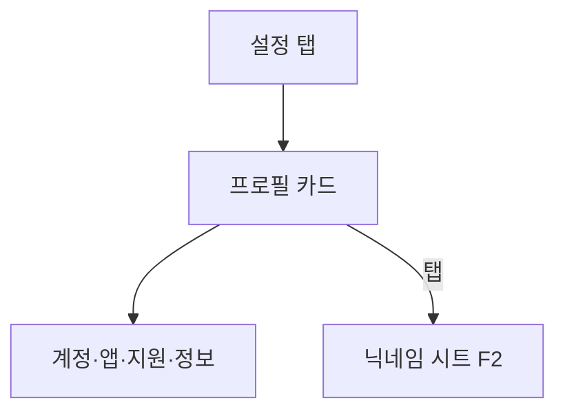
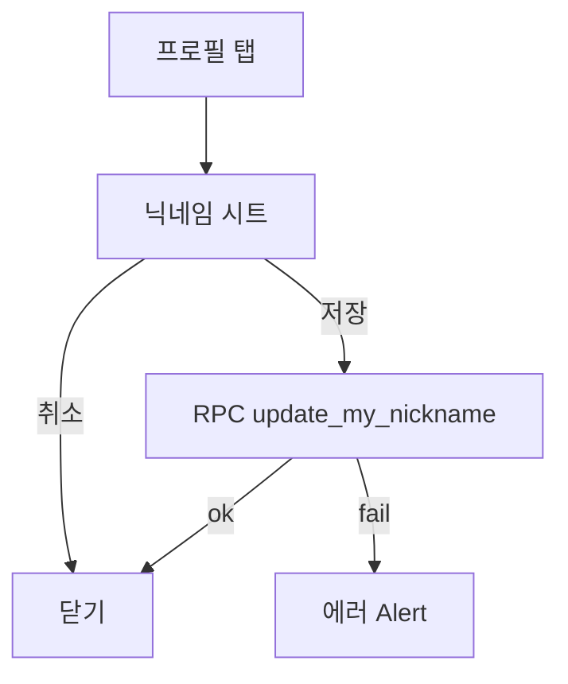
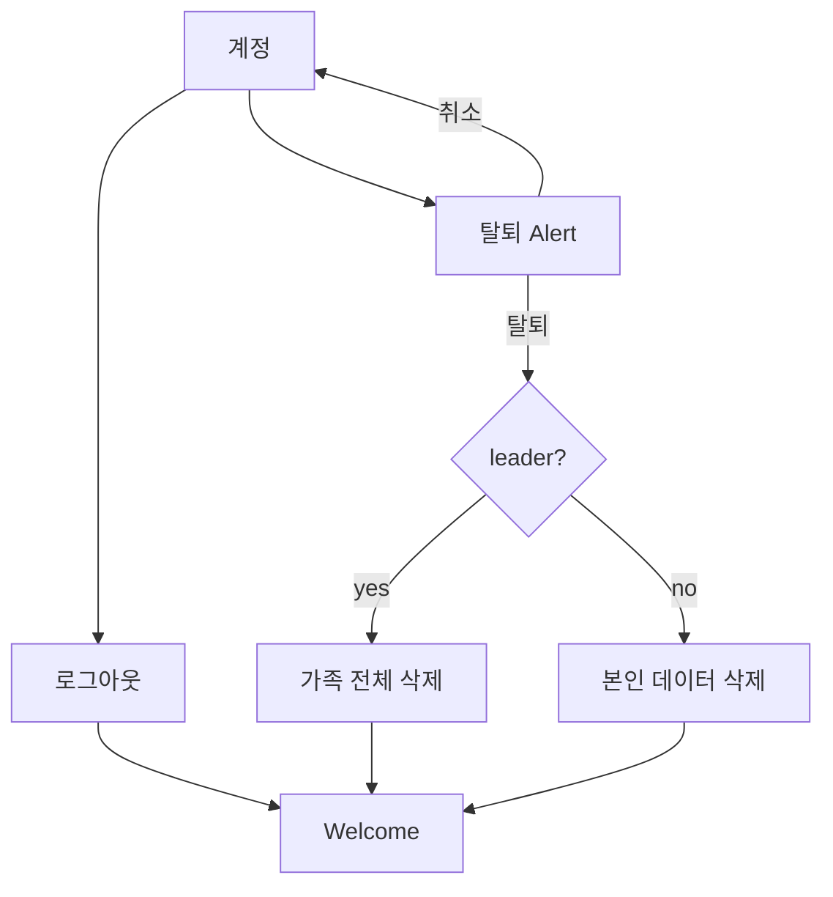
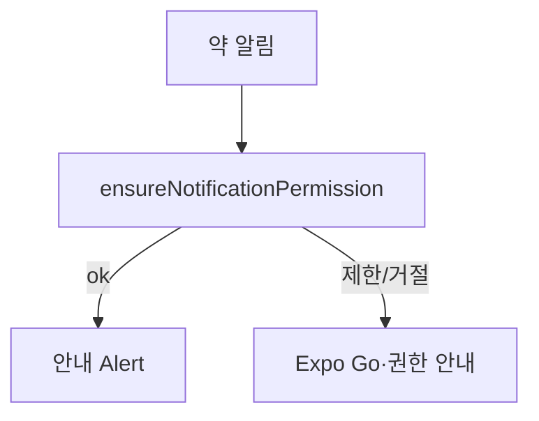

# 약콕 사용자 플로우 브리프 — 설정 탭

> GPT/이미지 생성용 입력 문서. 코드·PRD 스캔 결과.  
> 생성일: 2026-08-01 · stage: pre · 근거: `main` @ `6bf9097`  
> 범위: `/(tabs)/settings` · 계정·알림·고객지원·법적 stub (가족 ops는 [family-tab-flow-brief.md](./family-tab-flow-brief.md) · `/family-manage`)  
> 관련: [family-tab-flow-brief.md](./family-tab-flow-brief.md) (가족명 섹션「관리」·empty CTA·초대)

---

## 1. 제품 한 줄

멀리 사는 가족이 **오늘 복약·컨디션**과 **한 줄 안부**로 서로를 챙기는 앱(약콕).  
설정은 **프로필·계정·알림·문의**의 관리 허브. 가족 운영(이름·초대·멤버·삭제)은 **가족 탭** → `/family-manage`.

**브랜드/톤 (이미지 스타일 힌트)**

- 잔소리 없는 가족 건강 안부. 틸/세이지 케어. 병원·감시·CCTV UI 금지.
- grouped list + 짧은 한국어 라벨. 탈퇴/내보내기는 안부 톤 (`강퇴` → `내보내기`).
- 무거운 ops는 서브 화면·BottomSheet·Confirm Alert. 통계·배지 스트립 금지.

---

## 2. 역할

| 역할 | 앱에서의 이름 | 인증 | 설정 탭에서의 핵심 |
|------|---------------|------|-------------------|
| 가족장 | `family_leader` | OAuth / 개발 로그인 → 가족 생성 | 닉네임 · 로그아웃 · 탈퇴(**가족 전체 삭제**) · 약 알림 · 문의 (가족 ops는 가족 탭) |
| 보호자 | `guardian` | 초대 코드/QR | 닉네임 · 로그아웃 · 탈퇴(본인만) · 약 알림 · 문의 |
| 피보호자 | `care_recipient` | 6자리 코드/QR만 | 보호자와 동일 |

PRD 요약의 “보호자/피보호자” 이분법 → 코드는 **3역할**.  
설정 루트 UI는 역할 대칭(같은 `SettingsPage`). **가족 관리 행 없음** — ops는 가족 탭.

**게이트:** `/(tabs)/*`는 `familyId` 없으면 Welcome으로 Redirect. 설정 탭은 **이미 가족에 속한 세션**만 진입.

---

## 3. 화면 인벤토리 (구현 기준 · 설정 스코프)

| 라우트 | 화면 | 탭/스택 | 역할 | 상태 |
|--------|------|---------|------|------|
| `/(tabs)/settings` | 설정 루트 (프로필 카드 + grouped list) | tab | 전 역할 | implemented |
| (시트) 닉네임 변경 | BottomSheet on `SettingsPage` | modal | 전 역할 | implemented |

**가족 ops는 설정 스코프 밖** — `/family-manage` · `/invite-create` → [family-tab-flow-brief.md](./family-tab-flow-brief.md)

**PRD 대비 설정 탭에 있는 것**

| PRD (`요약` 설정 행) | 코드 | 비고 |
|----------------------|------|------|
| 프로필 | ✅ 카드 + 닉네임 시트 · `가족 · {name}` 표시 | implemented |
| 알림 권한 | ✅ “약 알림” 행 | OS 권한만 · 슬롯 토글 없음 |
| 로그아웃 | ✅ | implemented |
| (PRD 미기재) 탈퇴 | ✅ | PRD FR-01은 prod deferred — **코드는 pre에 구현** |
| (PRD 미기재) 가족 관리 | ❌ 설정에서 제거 | 가족 탭 섹션「관리」(leader) → `/family-manage` |
| (PRD 미기재) 문의·광고메일 | ✅ mailto | implemented |
| (PRD prod) 약관 | △ 행만 | URL stub |

**미구현·기획만 (설정 맥락)**

| 의도 화면/요소 | PRD/메모 | 상태 |
|----------------|----------|------|
| 이용약관·개인정보처리방침 URL | FR-01 prod · `SUPPORT.termsUrl`/`privacyUrl` = null | partial — “곧 공개할게요” |
| 알림 슬롯/채널 on·off UI | “알림 권한” 너머 | missing — `ensureNotificationPermission`만 |
| OAuth 프로바이더 로컬 | CHECKLIST 미체크 | partial — 개발 이메일 로그인 대체 (설정 밖) |
| Edge 푸시 운영 토글 | FR-05 prod | prod-only / settings에 없음 |
| 비leader “가족 나가기”(탈퇴 아닌 leave) | — | missing — **탈퇴하기**로만 이탈 |

---

## 4. 사용자 플로우

### F1. 설정 탭 열람 · 프로필 — `implemented`

- **역할**: both (전 역할)
- **진입**: 하단 탭 `설정` → `/(tabs)/settings`
- **관련 코드**: `pages/settings` · `features/family-ops` (`useFamilyInfoQuery`, `useUpdateMyNicknameMutation`) · `entities/family` (`useFamilyMembersQuery`) · `entities/user` (`ROLE_LABEL`, `relationSubtitle`)

| # | 스텝 | 화면/UI | 사용자 행동 | 시스템 반응 | 상태 |
|---|------|---------|-------------|-------------|------|
| 1 | 탭 진입 | `SettingsPage` · `PageTitle` “설정” | 설정 탭 | 프로필·가족명·역할 표시. 탭 크롬(뒤로) 없음 | implemented |
| 2 | 프로필 카드 | 닉네임 · 역할 · 관계 서브 · `가족 · {name}` | 탭 | 닉네임 시트 (F2) | implemented |
| 3 | 섹션 | 계정 / 앱 / 고객지원 / 정보 | — | `SettingsGroup` + `SettingsRow` | implemented |

**분기**

- `familyId` 없음 → 탭 게이트에서 Welcome (설정 미진입)
- 가족명 없음·연결만 → “가족에 연결되어 있어요”



---

### F2. 닉네임 변경 — `implemented`

- **역할**: both
- **진입**: 프로필 카드 탭
- **관련 코드**: `useUpdateMyNicknameMutation` · RPC `update_my_nickname` · `LIMITS.nicknameMaxLength`

| # | 스텝 | 화면/UI | 사용자 행동 | 시스템 반응 | 상태 |
|---|------|---------|-------------|-------------|------|
| 1 | 시트 | BottomSheet “닉네임 변경” | 입력 | maxLength | implemented |
| 2 | 저장 | Button | 저장 | mutation → 닫기 · `refreshProfile` | implemented |
| 3 | 취소 | outline | 취소 | 시트 닫기 | implemented |

**분기**

- 빈값 / 기존과 동일 → 저장 비활성
- 실패 → mutation 에러 Alert



---

### F3. 로그아웃 · 탈퇴 — `implemented`

- **역할**: both (탈퇴 결과는 역할별)
- **진입**: 계정 섹션
- **관련 코드**: `features/guardian-auth` (`useSignOutMutation`, `useWithdrawAccountMutation`) · RPC `withdraw_my_account`

| # | 스텝 | 화면/UI | 사용자 행동 | 시스템 반응 | 상태 |
|---|------|---------|-------------|-------------|------|
| 1 | 로그아웃 | SettingsRow | 탭 | 즉시 `signOut` → Welcome (멤버도 코드 시트 없음) | implemented |
| 2 | 탈퇴 | SettingsRow destructive | 탭 | Confirm Alert (역할별 카피) | implemented |
| 3 | 확인 | Alert “탈퇴하기” | 확인 | withdraw + signOut → welcome | implemented |

**재진입**

- 멤버가 스스로 나가면 코드가 안 나옴 → 리더가 가족 관리 초대 카드에서 **코드 재발급** 후 Welcome「초대코드를 받았어요」로 재진입
- 리더가 연결됨 초대 재발급 시 접속 중 멤버는 안내 Alert 후 강제 로그아웃

**분기**

- leader 탈퇴 → “가족이 삭제되고 모든 멤버·약·기록이 지워져요”
- 비leader 탈퇴 → “이 가족에서 나가고, 내 약·기록이 삭제돼요”
- PRD FR-01: 탈퇴는 **prod** 칸 — 코드는 **pre에 이미 구현** (문서 불일치 → G4)



---

### F4. 가족 화면 — **설정 스코프 밖** (가족 탭으로 이관)

- 예전: 설정 → 가족 행 → `/settings-family`
- **현재**: 가족 탭 섹션「관리」(leader) / empty CTA → `/family-manage`
- 상세 플로우: [family-tab-flow-brief.md](./family-tab-flow-brief.md) F5·F6

### F5. 초대 생성 퍼널 — **설정 스코프 밖**

- 진입: `/family-manage` → `FamilyInvitePanel` → `/invite-create`
- 복귀: `family-manage` (또는 `canGoBack`)
- 상세: [family-tab-flow-brief.md](./family-tab-flow-brief.md) F5

---

### F6. 약 알림 권한 — `partial`

- **역할**: both
- **진입**: 앱 섹션 “약 알림”
- **관련 코드**: `features/medication-notifications` (`ensureNotificationPermission`)

| # | 스텝 | 화면/UI | 사용자 행동 | 시스템 반응 | 상태 |
|---|------|---------|-------------|-------------|------|
| 1 | 권한 | SettingsRow | 탭 | OS 권한 요청 (Expo Go면 모듈 null → false) | implemented |
| 2 | 결과 | Alert | — | 성공: “약 먹을 시간에 알려드릴 수 있어요” / 실패: Expo Go 제한 안내 | implemented |
| 3 | 슬롯별 on/off · 조용한 시간 | — | — | 설정 UI 없음 | missing |



---

### F7. 고객지원 · 법적 문서 — `partial`

- **역할**: both
- **진입**: 고객지원 / 정보 섹션
- **관련 코드**: `shared/config/support.ts` (`supportMailTo`, `adsMailTo`, `SUPPORT`)

| # | 스텝 | 화면/UI | 사용자 행동 | 시스템 반응 | 상태 |
|---|------|---------|-------------|-------------|------|
| 1 | 문의하기 | mailto `support@yakmuk.app` | 탭 | 메일 앱 · 불가 시 Alert | implemented |
| 2 | 광고·제휴 문의 | mailto `ads@yakmuk.app` | 탭 | 메일 앱 | implemented |
| 3 | 앱 버전 | value only | — | Expo Constants | implemented |
| 4 | 이용약관 · 개인정보처리방침 | SettingsRow | 탭 | URL null → “곧 공개할게요.” | partial |

---

## 5. 역할 × 플로우 매트릭스

| 플로우 | family_leader | guardian | care_recipient | 비고 |
|--------|---------------|----------|----------------|------|
| F1 설정 열람 | ✅ | ✅ | ✅ | UI 대칭 · 가족 행 없음 |
| F2 닉네임 | ✅ | ✅ | ✅ | |
| F3 로그아웃 | ✅ | ✅ | ✅ | |
| F3 탈퇴 | ✅ (가족 삭제) | ✅ (본인만) | ✅ (본인만) | PRD는 prod deferred |
| F4·F5 가족 ops·초대 | — | — | — | 가족 탭 `/family-manage` |
| F6 약 알림 권한 | ✅ | ✅ | ✅ | 토글 UI missing |
| F7 문의·약관 stub | ✅ | ✅ | ✅ | URL은 prod |

범례: ✅ 가능 · ❌ 불가 · — 해당 없음

---

## 6. 갭 · 부족한 부분

우선순위: P0(지금 막힘) → P1(PRD/스토어) → P2(polish/prod).

| ID | 갭 | 근거 | 영향 플로우 | 우선 |
|----|-----|------|-------------|------|
| G1 | 이용약관·개인정보 URL stub | `SUPPORT.termsUrl`/`privacyUrl` = null | F7 | P1 → 스토어 전 **P0** |
| G2 | 알림 = OS 권한 요청만. 슬롯/채널 토글 없음 | `SettingsPage` `onNotifPermission` | F6 | P2 |
| G3 | 비leader “가족 나가기” 전용 없음 | 탈퇴만 (`withdraw_my_account`) | F3·F4 | P2 |
| G4 | PRD vs 코드: 탈퇴는 FR-01 **prod**인데 pre 구현됨 | SUMMARY vs `withdrawMyAccount` | F3 | docs sync |
| G5 | OAuth 로컬 프로바이더 | CHECKLIST 미체크 | auth (설정 밖) | P1 |
| G6 | Edge 푸시·운영 알림 설정 UI | FR-05 prod | F6 | prod-only |

**의도적으로 빠진 것 (out of scope / stage)**

- 설정에서 약 CRUD · 피드 · 컨디션 (홈·가족 탭)
- 다중 가족 전환 · 커머스/광고 타깃 설정
- hosted OAuth·스토어 딥링크 운영 검증 (pre는 로컬/개발 로그인)

---

## 7. 이미지 생성 지시 (GPT에 붙여넣기)

아래 블록을 **그대로** 이미지/다이어그램 생성 프롬프트로 사용한다.

```
제품: 약콕 — 멀리 사는 가족이 오늘 복약·컨디션과 안부로 서로를 챙기는 모바일 앱
범위: 설정 탭(/(tabs)/settings)만 — 가족 ops는 가족 탭 문서
목표: 한국어 UX 사용자 플로우 다이어그램 이미지
스타일: 깔끔한 플로우차트, 카드형 화면 노드, 짧은 한국어 라벨
역할 색: 가족장=#2F6F68(틸), 보호자=#5B8A84, 피보호자=#C4A574(웜 중립) — 보라/네온/감시 UI 금지
톤: 따뜻한 가족 안부, 병원 대시보드·CCTV 느낌 금지

포함할 플로우 (swimlane 또는 패널):
1) F1 설정 루트: 탭 → 프로필 카드(가족명 표시만) → 계정/앱/지원/정보
2) F2 닉네임: 카드 탭 → BottomSheet → 저장
3) F3 로그아웃 / 탈퇴: Alert → Welcome (리더 탈퇴=가족 전체 삭제 강조)
4) F6 약 알림: 권한 요청 → 안내 Alert
5) F7 문의 mailto · 약관은 점선 “곧 공개”
(가족 관리·초대는 이 장에 넣지 않음 — 가족 탭 다이어그램)

갭은 점선 노드 + "미구현/부분":
- G1 약관·개인정보 URL
- G2 알림 슬롯 토글 없음
- G3 비리더 가족 나가기 전용 없음

출력: 가로 16:9 한 장. 설정 루트(F1–F3,F6–F7) 중심
```

**패널 분할 제안** (이미지 여러 장일 때)

1. Settings root (F1–F3, F6–F7)  
2. Gaps overlay (G1–G6)

---

## 8. 변경 이력

| 날짜 | 요약 |
|------|------|
| 2026-08-01 | 설정 탭 스코프 초안 · 재검토 후 저장 (`SettingsPage`·`SettingsFamilyPage`·invite·auth·SUPPORT 코드 기준) |
| 2026-08-01 | 가족 관리 설정 제거 · `/family-manage`는 가족 탭 진입으로 이관 |
